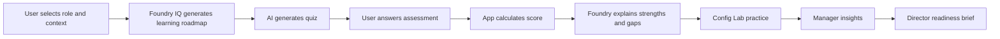
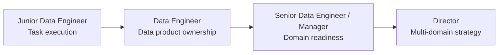
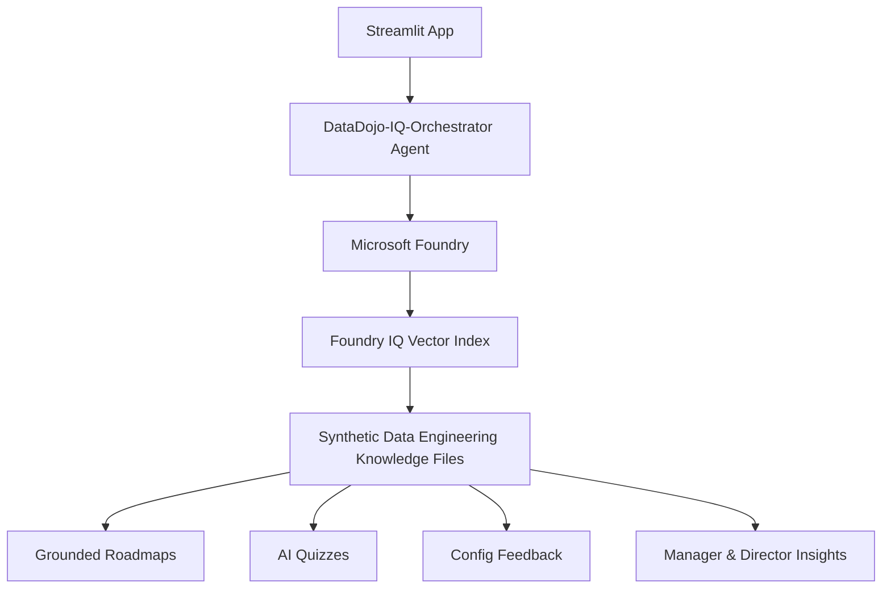

## Live Demo

Live App: https://datadojo-iq-foundry.streamlit.app/

# DataDojo IQ

**From KT Calls to Data Engineering Readiness.**

DataDojo IQ is a multi-agent Data Engineering readiness platform built for the Microsoft Foundry Reasoning Agents challenge. It helps data engineering teams convert learning content, role expectations, assessments, and pipeline practice into a structured readiness workspace for learners and managers.

The project includes a polished Streamlit frontend connected to a Microsoft Foundry agent. The Foundry agent uses uploaded synthetic Data Engineering knowledge documents through a vector index as the Foundry IQ grounding layer.

---

## ✨ What Makes DataDojo IQ Unique?

<table>
<tr>
<td width="50%">

### 🧭 AI Learning Roadmaps

Generate personalized role-based learning paths using Foundry IQ grounded knowledge.

</td>
<td width="50%">

### 📝 AI Readiness Quizzes

Generate role-specific quiz questions, auto-score answers, and show explanations.

</td>
</tr>
<tr>
<td width="50%">

### ⚙️ Config Practice Lab

Practice realistic synthetic Data Engineering scenarios and get AI evaluation feedback.

</td>
<td width="50%">

### 📊 Manager & Director Insights

Roll up readiness into team-level and executive-level insights.

</td>
</tr>
</table>

---

## 🧠 Product Flow



---

## 🥋 Career Mission Map



| Role                              | Mission Focus                      | AI Activity                            | Unlocks                    |
| --------------------------------- | ---------------------------------- | -------------------------------------- | -------------------------- |
| 🟦 Junior Data Engineer           | Task execution and pipeline basics | Roadmap, quiz, config practice         | Data Product Ownership     |
| 🟩 Data Engineer                  | Own one data product               | Scenario labs and readiness assessment | Domain Leadership          |
| 🟪 Senior Data Engineer / Manager | Guide team and domain readiness    | Manager insights and team action plan  | Multi-domain Strategy      |
| 🟧 Director                       | Oversee multiple domains           | Executive readiness brief              | Enterprise Data Excellence |

---

## 🏗️ Architecture



---

## 🛠️ Microsoft Tools Used

| Tool                      | Usage                                             |
| ------------------------- | ------------------------------------------------- |
| **Microsoft Foundry**     | Agent creation and orchestration                  |
| **Foundry IQ**            | Grounding layer through synthetic knowledge files |
| **Azure AI Projects SDK** | Streamlit-to-Foundry integration                  |
| **GitHub Copilot**        | Assisted development                              |
| **Streamlit**             | Interactive web app                               |
| **Python**                | App logic, parsing, scoring, and UI control       |

---

## 📚 Foundry Knowledge Base

The Foundry agent is grounded using synthetic Data Engineering documents:

```text
knowledge_base/
├── dataops_learning_guide.md
├── pipeline_config_rules.md
├── load_type_rules.md
├── troubleshooting_guide.md
└── certification_requirements.md
```

These files help the agent generate:

* Role-based learning roadmaps
* Grounded quiz questions
* Config lab scenarios
* Score interpretation
* Revision resources
* Manager insights
* Director readiness briefs

---

## 🧩 App Modules

### 1. 🧭 AI Learning Roadmap

Users select role, domain, data product, target skill, study hours, and confidence level. Foundry generates a grounded week-by-week roadmap.

### 2. 📝 AI Assessment

Foundry generates quiz questions. The user answers them, and DataDojo IQ calculates the score automatically. The app then shows correct answers, explanations, readiness status, and recommended next steps.

### 3. ⚙️ Config Practice Lab

Foundry creates realistic synthetic pipeline scenarios. The learner submits an answer, and Foundry evaluates the solution with score-style feedback, risks, missing items, and best-practice guidance.

### 4. 📊 Manager Insights

Managers can view synthetic readiness summaries, skill gaps, data product risks, coaching actions, and revision plans.

### 5. 🧑‍💼 Director View

Directors can generate executive readiness briefs across multiple synthetic domains with strategic recommendations and 30-day action plans.

---

## 🔒 Data Safety

DataDojo IQ uses **synthetic data only**.

It does **not** include:

* Real employee data
* Real customer data
* PII
* Credentials
* Secrets
* Confidential documents
* Real company data
* Real table names
* Internal system names

---

## ⚙️ Environment Variables

Create a local `.env` file or configure Streamlit Secrets during deployment.

```env
AZURE_AI_PROJECT_ENDPOINT=your_foundry_project_endpoint
AZURE_AI_AGENT_NAME=DataDojo-IQ-Orchestrator
AZURE_AI_AGENT_VERSION=latest
AZURE_TENANT_ID=your_tenant_id
AZURE_CLIENT_ID=your_client_id
AZURE_CLIENT_SECRET=your_client_secret
```

> ⚠️ Do not commit `.env` to GitHub.

---

## 🧪 Run Locally

```bash
git clone https://github.com/rishitha-21bce7023/DataDojo-IQ.git
cd DataDojo-IQ

python3 -m venv .venv
source .venv/bin/activate

python -m pip install -r requirements.txt
python -m streamlit run app.py
```

---

## 🚀 Deployment

The app is deployed using **Streamlit Cloud**.

Secrets are configured using Streamlit Secrets and are not stored in GitHub.

---

## ✅ Responsible AI Notes

DataDojo IQ follows these principles:

* Uses synthetic data only
* Avoids confidential and personal information
* Grounds responses using approved synthetic knowledge files
* Provides explanations and recommendations
* Keeps manager and director insights aggregated
* Uses external learning resources for revision and practice

---

## 🏁 Submission Summary

DataDojo IQ demonstrates a Microsoft Foundry-powered multi-agent readiness platform for Data Engineering teams. It combines Foundry IQ grounding, AI-generated learning roadmaps, dynamic assessments, automatic scoring, config practice, and leadership insights in a premium Streamlit experience.

<div align="center">

### Built by **Rishitha** for the **Microsoft Foundry Reasoning Agents Challenge**


</div>
